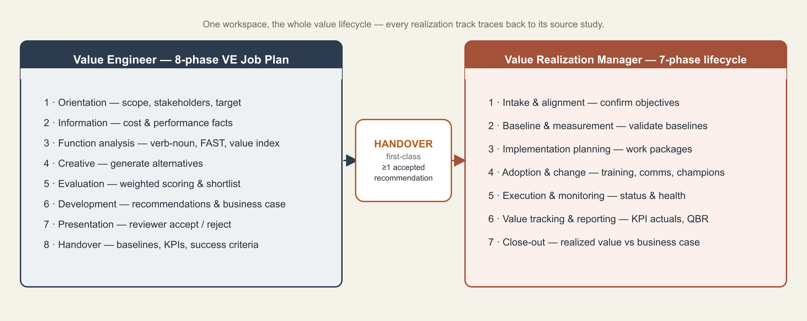
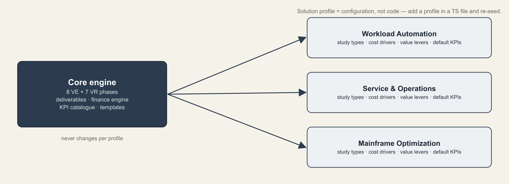
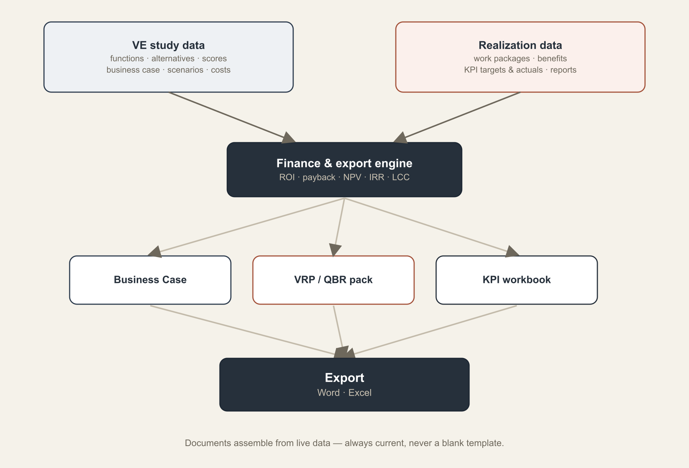
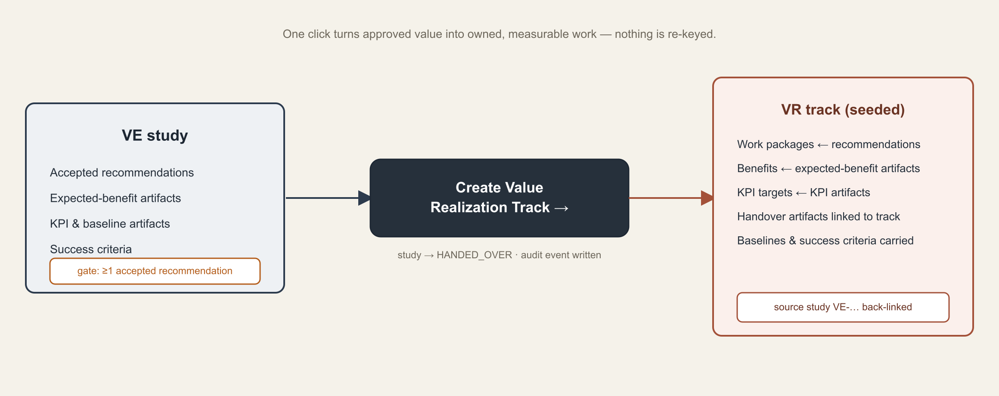
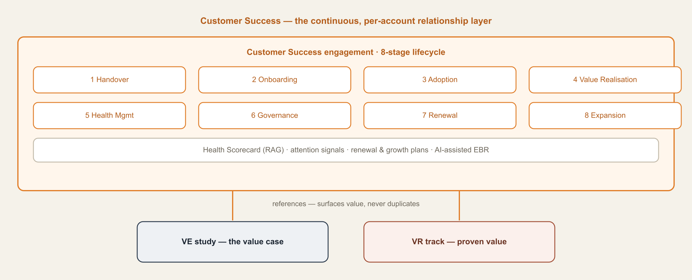
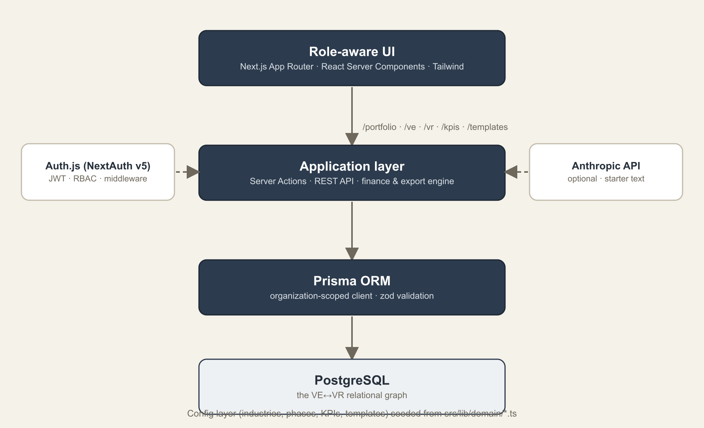

# Value Lifecycle Platform — Solution Design Document

*One workspace for the whole value lifecycle — a value engineer who finds and quantifies value, a realization manager who implements and proves it, and a customer success manager who retains and grows the relationship. This document explains the design and shows the workflow and architecture as diagrams.*

> The `.docx` version in this kit has the diagrams embedded as images (so they render anywhere, including OneDrive/Word). This Markdown version references the same images from the `diagrams/` folder and renders in GitHub, VS Code and Obsidian.

---

## 1. Purpose

Organisations are good at identifying value — value-engineering studies, business cases, board approvals — and poor at proving it was ever realized, then keeping and growing the accounts where it was. The study lives in one team's deck; the realization lives in another team's spreadsheet; the renewal conversation runs on activity metrics rather than proven value; the links between them are email threads. The Value Lifecycle Platform closes that loop by running all three roles in one system and making the handovers between them first-class.

Three complementary roles, three structured methods: **the Value Engineer runs an 8-phase VE Job Plan; the Value Realization Manager runs a 7-phase realization lifecycle; the Customer Success Manager runs a continuous 8-stage customer-success lifecycle.** Every realization track traces back to the study, business case and success criteria it came from — and every customer-success engagement references, but never re-keys, the value those studies and tracks prove.

## 2. The value lifecycle

A piece of work moves from a framed problem, through a quantified business case and a governance gate, into implementation and proof of realized value. The platform turns that lifecycle into a guided sequence, teaching at each phase and using each phase's exit criteria as a quality gate.

The engineering side ends where the realization side begins — at the handover; realization ends at close-out, where **Customer Success** picks up the continuous relationship (§6). Three deliberately different methods, joined by first-class links.

## 3. Industry as configuration

The workflow is data-driven, not hard-coded. The core engine — the 8 VE and 7 VR phases, the deliverables, the finance engine and the KPI catalogue — is the same for everyone. An industry profile layers on the study types, cost drivers, value levers and default KPIs that make a study feel native to that sector.

Adding an industry means editing a TypeScript module in `src/lib/domain/` and re-seeding — construction, manufacturing and SaaS ship out of the box. The engine never changes.

## 4. From data to documents

Function analysis, the business case, work packages, benefits and KPIs are entered once. The finance and export engine turns that live data into the deliverables leadership actually asks for — a board-ready business case, a Value Realization Plan / QBR pack, and a KPI workbook.

Because documents are generated from live data they always reflect the current state — regenerate before a steering meeting and the pack is up to date. ROI, payback, NPV, IRR and life-cycle cost are computed deterministically in the finance engine, not typed by hand.

## 5. The handover — the marquee flow

This is the point of the product. From a study with at least one accepted recommendation, one action creates a linked realization track and pre-populates it from the study.

- **Guarded:** the handover requires at least one reviewer-**accepted** recommendation — the governance gate between proposed and committed value.
- **Seeded, not re-keyed:** work packages come from the recommendations, benefits from the expected-benefit artifacts, KPI targets (with baselines) from the KPI artifacts, and success criteria carry across.
- **Traceable:** the study is marked handed-over, an audit event is written, and the track back-links to its source study.

## 6. Customer Success — the continuing relationship

Value Realization proves *one* initiative and then ends at close-out; **Customer Success** is the *continuous*, per-account layer that carries the relationship on through renewal and expansion. It is a separate pillar with its own role (the CSM) and its own 8-stage lifecycle — not a change to VR.

- **References, never duplicates.** A CS engagement links to the account's VE studies and VR tracks and *surfaces* their planned/realized value; the numbers still live on the tracks (single source of truth).
- **Health, proactively.** A weighted **Health Scorecard** (adoption, value, sentiment, support, engagement) rolls up to a green/amber/red band, and **attention signals** flag renewals due, poor health, overdue actions, detractor stakeholders and value below plan — on the engagement and in the portfolio.
- **Governance & growth.** Stakeholder map, action log, renewal and growth plans; an **EBR narrative** (AI via the Anthropic seam, or a template fallback) that seeds its next-best-actions into the action log; and an Account Success Review export.

## 7. System architecture

A single-language, type-safe stack. Role-aware React Server Components render the dashboards; server actions and REST routes handle mutations and exports; Prisma talks to PostgreSQL through an organisation-scoped client; and the relational model holds the VE↔VR↔CS graph together.

- **Role-aware UI:** `/portfolio`, `/ve`, `/vr`, `/cs`, `/kpis`, `/templates`; capabilities resolve from the signed-in user's role.
- **Application layer:** server actions (create study, phase status, recommendation decisions, handover, KPI actuals) plus REST routes and the finance/export engine.
- **AI is optional and never authoritative:** the Anthropic seam produces starter text only; the static template library is the fallback.

## 8. Domain & data model

Everything hangs off the Organisation (the tenant). On the engineering side: `Study → StudyPhase → PhaseTask`, `FunctionItem → Alternative → Recommendation`, and `BusinessCase → Scenario → CostItem`. On the realization side: `RealizationTrack → VrPhaseInstance`, `WorkPackage`, `AdoptionPlan`, `Benefit`, `ValueReport` and `LessonLearned`.

**The bridge:** a `HandoverArtifact` captures each expected benefit, KPI, baseline, measurement plan and success criterion on the study, and is linked to the `RealizationTrack` on handover. A track's `studyId` is **optional** — `origin` is `VE_HANDOVER` (has a source study) or `STANDALONE` (software already in place, no study). **Customer Success** adds `CustomerSuccessEngagement → CsStageInstance` plus `Stakeholder`, `ActionItem`, `HealthScore`, `RenewalPlan` and `GrowthPlan`; studies and tracks carry an optional `engagementId` so an engagement references them without copying. KPIs are modelled as `KpiDefinition` (catalogue) → `KpiTarget` (on a study or track) → `KpiActual` (time series). `Comment`, `AuditEvent` and `DocumentVersion` provide governance across the model.

## 9. Multi-tenancy, roles & governance

Self-service registration creates a new, isolated Organisation with the signer as Admin; every study and track is scoped to its organisation. Role-based access maps each role — Value Engineer, Value Realization Manager, Customer Success Manager, Reviewer, Viewer, Admin — to a capability set enforced on the server; the UI merely hides what a role can't do.

Admins manage the team from a dedicated page: add members with an initial password, change roles, reset passwords, and remove access. Removing a member who owns studies, tracks or comments reassigns that work to another member first, so nothing is orphaned. Business-case snapshots (version history) and an audit log keep the realized-vs-planned reconciliation defensible.

## 10. Key design principles

| Principle | What it means in the product |
|---|---|
| The handover is first-class | Every realization track has a required link to its source study; work packages, benefits and KPI targets are seeded from the study — nothing is re-keyed. |
| One source of truth | Function analysis, business case, baselines and KPIs are entered once and drive every register, document and report. |
| Separation of duties | The engineer builds, a reviewer approves, the manager realizes — role capabilities enforced on the server, not just hidden in the UI. |
| Prove it against a baseline | Realized value is measured against baselines captured at handover; versions and an audit log keep the reconciliation honest. |
| Industry is configuration | Study types, cost drivers, value levers and default KPIs live as seeded data — add an industry without touching the engine. |
| Deterministic finance | ROI, payback, NPV, IRR and life-cycle cost are computed in code; the finance engine is authoritative. |
| AI proposes, human disposes | AI produces starter text only, with a template fallback; the product is fully usable with AI switched off. |

## 11. Technology stack

- **Frontend:** Next.js 15 (App Router) · React Server Components · TypeScript (strict) · Tailwind CSS (VE = blue, VR = emerald, CS = cyan)
- **Application:** server actions + REST API · zod validation · finance engine (ROI · payback · NPV · IRR · LCC)
- **Data:** Prisma 6 · PostgreSQL — the VE↔VR↔CS relational graph
- **Auth:** Auth.js (NextAuth v5) credentials, JWT sessions, edge-safe middleware · capability-based RBAC
- **AI (optional):** Anthropic API, structured outputs, starter text with a template fallback
- **Exports:** docx (Word business case & VRP/QBR) · exceljs (Excel KPI workbook)

## 12. What's built

A complete platform across all three pillars: the 8-phase VE Job Plan with function analysis, a FAST diagram, a weighted evaluation matrix and inline editing throughout; a live business-case builder with the finance engine, multi-currency, version history and Word export; the first-class VE→VR handover plus standalone VR tracks (software already in place); the 7-phase realization lifecycle with work packages, adoption plan, KPI tracker and benefits realization; the **Customer Success pillar** — per-account engagements, the 8-stage lifecycle, a weighted health scorecard, attention signals, stakeholder map, action log, renewal/growth plans, AI-assisted EBRs and an Account Success Review export; portfolio and KPI dashboards (with a CS lens); real Auth.js login with role-based access; self-service registration with admin team management including owner reassignment; and Excel capture-workbooks with an importer for all three pillars.

*The Value Lifecycle Platform — one workspace that turns approved value into proven value and proven value into a retained, growing relationship.*
