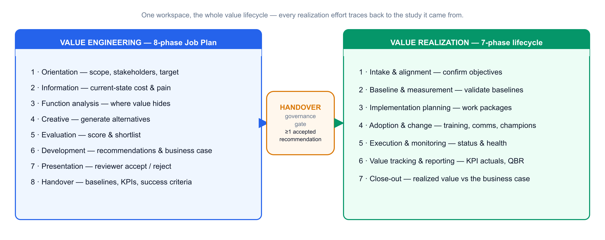
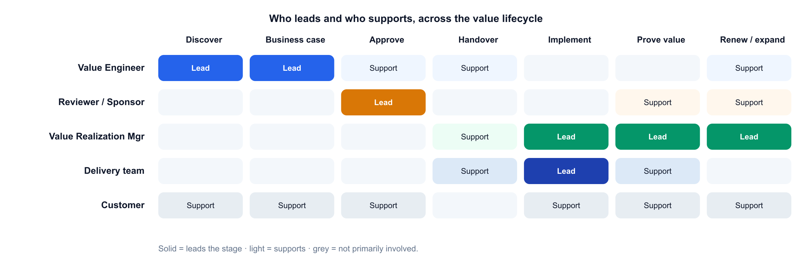
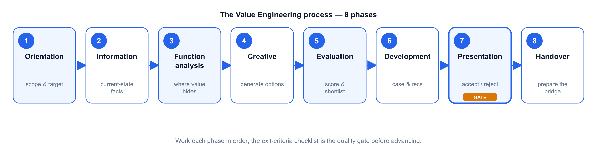
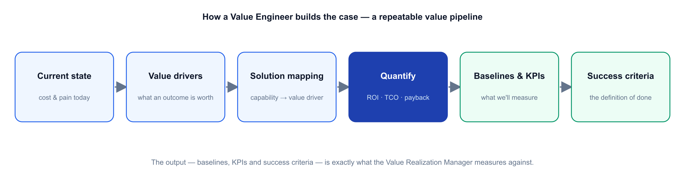
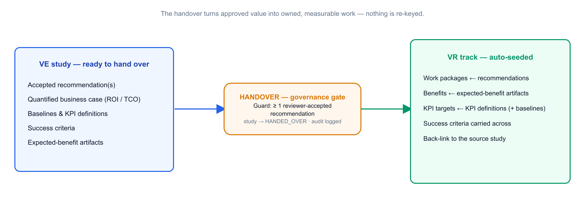
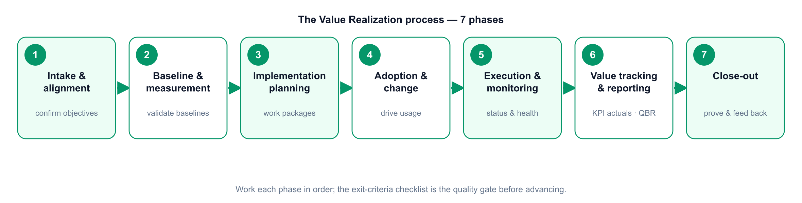

# Value Engineering & Value Realization

## The end-to-end process — a practitioner's guide

A learning guide to how the two value roles work, from a first conversation with a customer through to proven, renewed value. It explains the **Value Engineering (VE)** process, the **handover**, and the **Value Realization (VRM)** process — phase by phase — with the flow diagrams, checklists and a worked example you need to actually run it end to end.

> **How to use this guide.** Read Sections 1–3 for the big picture, then Part A (Value Engineering) and Part B (Value Realization) for the detailed process. The quick-reference checklists (Section 12) are your day-to-day companion. Diagrams appear at the start of each part — screenshot them for your own decks.

---

## Contents

1. Introduction — what this is and why it matters
2. The value lifecycle at a glance
3. Roles & responsibilities
4. **Part A — The Value Engineering process** (8 phases)
5. The handover — the first-class bridge
6. **Part B — The Value Realization process** (7 phases)
7. Measuring value — the business case & KPIs
8. Governance, artifacts & the enabling platform
9. A worked example, end to end
10. Good practice & common pitfalls
11. Roles glossary & key terms
12. Quick-reference checklists

---

# 1 · Introduction

**Value Engineering** and **Value Realization** are two complementary disciplines that together answer a single question a customer's leadership always asks: *"If we buy this, will we actually get the value — and can you prove it?"*

- **Value Engineering (VE)** happens *before the sale*. A Value Engineer works with the customer to understand the current-state cost and pain, map the right solution capability to the outcomes that matter, and build a **quantified business case** — ROI, TCO, payback — with the baselines and success criteria the value will later be judged against.
- **Value Realization (VRM)** happens *after the sale*. A Value Realization Manager takes that business case forward, drives the adoption that makes the value real, tracks the KPIs against the baselines, reports realised value to the customer's leadership, and uses the proof to secure the renewal and expand the account.

The **handover** between them is the point of the whole model. Most value leaks in the gap between the promise made at the sale and the outcome measured after go-live. A disciplined handover closes that gap: the baselines and success criteria captured to *win* the deal become exactly what is measured to *prove* it.

> **Why this matters now.** Software is increasingly sold on subscription and consumption, so revenue rides on renewals and expansion rather than one-off licences. The partner — or vendor — who can quantify value up front and prove it afterwards wins the deal, protects the renewal, and grows the account. This process is how you do that repeatably.

**Two structured methods.** VE follows an **8-phase Job Plan**; VRM follows a **7-phase lifecycle**. They are deliberately different — one builds and quantifies, the other implements and proves — joined by one required link.

---

# 2 · The value lifecycle at a glance

Read the lifecycle left to right. A piece of work starts as a **VE study**, moves through the 8-phase Job Plan to a quantified, reviewer-approved business case, crosses the **handover** gate, and continues as a **Value Realization track** through the 7-phase lifecycle to proven value and renewal.

> **Two ways in.** Most tracks begin as a VE study and cross the handover gate. But when the software is *already in place* — there's no new business case to build, you simply need to protect and prove the value of what the customer already owns — you can start a **standalone Value Realization track** directly, with no study behind it. It runs the same 7-phase lifecycle; you set the baselines from the existing deployment instead of inheriting them from a study. See §5.1.

Three ideas hold it together:

1. **One source of truth.** Function analysis, the business case, baselines and KPIs are entered once and drive every register, document and report on both sides. Nothing is re-keyed at the handover.
2. **Exit criteria as gates.** Each phase has a checklist of exit criteria. You do not advance until it is genuinely met — this keeps the work defensible.
3. **Separation of duties.** The person who *builds* the case is not the person who *approves* it, and (usually) not the person who *realizes* it. That separation is what makes the numbers credible.

---

# 3 · Roles & responsibilities

| Role | Owns | Engages |
|---|---|---|
| **Value Engineer (VE)** | The business case — discovery, value mapping, ROI/TCO, success criteria | Pre-sales & deal-shaping, to close |
| **Value Realization Manager (VRM)** | The value plan — adoption, KPI tracking, QBRs, renewal & expansion | From go-live, across the lifecycle |
| **Reviewer / Sponsor** | The governance gate — accept or reject recommendations | At the approval point before handover |
| **Delivery / implementation team** | Building and configuring the solution | Implementation & execution |
| **Account executive** | The commercial relationship and the deal | Throughout |
| **Solution architect** | Technical fit and design | Pre-sales & delivery |
| **Customer stakeholders** | Their outcomes, baselines and sign-off | Throughout — this is *their* business case |
| **Vendor / OEM** | Product, value frameworks & benchmarks | Aligned throughout |

> **Roles, not necessarily headcount.** A strong pre-sales consultant can play the Value Engineer; an engaged delivery lead or customer-success person can play the Value Realization Manager. Start by having people wear the hat on strategic deals, then formalise where it pays off.

---

# Part A — The Value Engineering process

The VE Job Plan takes a framed problem to a quantified, approved business case in eight phases. Work them in order; each phase's **exit criteria** are the quality gate before you advance. The pattern is *understand → analyse → generate → evaluate → develop → present → hand over*.

## 4.1 · Phase 1 — Orientation

*Purpose.* Frame the opportunity: agree the scope, the stakeholders and the target outcome before doing any analysis.

- **Key activities:** confirm the business problem and scope; identify the economic buyer and the stakeholders who own the numbers; agree the target outcome and rough value hypothesis; set the timeline.
- **Inputs:** the opportunity, the account plan, first-call notes.
- **Outputs:** a one-line problem statement, a stakeholder map, a value hypothesis.
- **Exit criteria:** scope and target outcome agreed; the right business and finance stakeholders identified and available.
- **Tip:** get a *business* sponsor, not just an IT contact — the case is for their budget.

## 4.2 · Phase 2 — Information

*Purpose.* Assemble the current-state facts — the cost and the pain — in the customer's own numbers.

- **Key activities:** gather current-state cost and performance data (e.g. licence & run cost, incident / failure data, effort and volumes, tool inventory); document the pain and its business impact; agree the data sources and assumptions.
- **Inputs:** customer data, benchmarks from the vendor's value frameworks, discovery workshops.
- **Outputs:** a validated current-state baseline and a documented pain list.
- **Exit criteria:** the numbers are sourced and agreed with the customer; assumptions are explicit.
- **Tip:** a soft baseline flatters everything downstream — insist on honest, sourced figures now.

## 4.3 · Phase 3 — Function analysis

*Purpose.* Work out where the value actually hides — which functions cost far more than they are worth.

- **Key activities:** break the current state into functions (what the customer is trying to *achieve*, in verb-noun terms); attach cost and worth to each; find the high cost-to-worth functions — that is where value engineering pays.
- **Inputs:** the Information-phase baseline.
- **Outputs:** a ranked view of where cost and value are misaligned.
- **Exit criteria:** the highest-value functions are identified and agreed as the focus.
- **Tip:** spend creative effort only where the value index is worst; don't optimise what is already good value.

## 4.4 · Phase 4 — Creative (speculation)

*Purpose.* Generate options for delivering the high-value functions better — including the fitting solution capability.

- **Key activities:** brainstorm ways to improve or replace each high-value function; map the relevant solution capability to the value drivers; don't judge yet, just generate.
- **Inputs:** the function analysis; the solution portfolio and its value drivers.
- **Outputs:** a spread of candidate alternatives linked to functions.
- **Exit criteria:** at least a few credible alternatives per high-value function.
- **Tip:** think across the portfolio — the best answer may combine capabilities rather than a single product.

## 4.5 · Phase 5 — Evaluation

*Purpose.* Score the alternatives objectively and shortlist the winners.

- **Key activities:** define criteria and weights (value, cost, risk, feasibility, time-to-value); score each alternative; rank; shortlist the ones worth developing.
- **Inputs:** the alternatives; agreed criteria & weights.
- **Outputs:** a ranked, shortlisted set of alternatives with a transparent rationale.
- **Exit criteria:** a defensible shortlist the account team and customer accept.
- **Tip:** make the weights explicit up front so scoring is a discussion about the customer's priorities, not a fight about the maths.

## 4.6 · Phase 6 — Development

*Purpose.* Turn the shortlist into developed recommendations and a quantified business case.

The business case follows a repeatable pipeline: **current state → value drivers → solution mapping → quantify → baselines & KPIs → success criteria**. The finance is computed, not asserted.

- **Key activities:** develop each shortlisted idea into a recommendation with technical and commercial detail; build the financials — **ROI, TCO, payback**, and where relevant **NPV / IRR** — often as a switch / consolidation case (e.g. cost takeout, tool consolidation, or a competitive displacement); define the **baselines, KPIs and success criteria** realization will be measured against.
- **Inputs:** the shortlist; the current-state baseline; vendor benchmarks.
- **Outputs:** developed recommendations; a board-ready business case; the value-handover items (baselines, KPI definitions, success criteria).
- **Exit criteria:** each recommendation has technical + commercial detail; the financials are computed and sanity-checked; baselines, KPIs and success criteria are drafted.
- **Tip:** the baselines you set here *are* the yardstick the VRM will use — write them as if you will have to prove them, because someone will.

## 4.7 · Phase 7 — Presentation *(governance gate)*

*Purpose.* Present the case for a decision — the gate between *proposed* value and *committed* work.

- **Key activities:** present the recommendations and business case to the customer's decision-makers; a **Reviewer** accepts or rejects each recommendation; capture the decision.
- **Inputs:** the developed business case.
- **Outputs:** **accepted** recommendations (and rejected ones, recorded).
- **Exit criteria:** at least one recommendation is formally **accepted** — the guard for handover.
- **Tip:** only accepted recommendations can be handed over. This is the governance line; keep the person who approves separate from the person who built the case.

## 4.8 · Phase 8 — Handover

*Purpose.* Package everything the realization side needs and create the linked track. Covered in detail next.

---

# 5 · The handover — the first-class bridge

The handover is a single action with a guard and an automatic effect. From a study with **at least one accepted recommendation**, creating a **Value Realization track** pre-populates it directly from the study:

- **Work packages** ← the accepted recommendations
- **Benefits** ← the expected-benefit artifacts
- **KPI targets** (with baselines) ← the KPI definitions
- **Success criteria** carried across unchanged
- A **back-link** to the source study, so both sides always see each other's status

The study is marked **handed over**, and an audit event is written. Nothing is re-keyed. This is the difference between "we implemented it" and "we can prove it": the yardstick that won the deal is the same yardstick used to measure success.

> **The differentiator.** *Don't just implement — prove.* Anyone can install the same product; the handover is what lets you stand behind the outcome.

## 5.1 · When there's no study — standalone realization

Sometimes there is nothing to hand over. The customer already runs the software and the job is purely to **realize value from what they own** — renewal assurance, an adoption rescue, or a value health-check on an installed product. For this, start a **standalone VR track**: it skips VE and the handover entirely and opens straight into the 7-phase lifecycle.

The trade-off is that nothing is pre-seeded. A handover track arrives with work packages, benefits and KPI targets already populated from the study; a standalone track starts blank, so **you establish the baselines and KPI targets yourself in Phase 2** from the live deployment. Everything downstream — adoption, execution, value tracking, QBRs, close-out — is identical, and the track is clearly marked as *standalone* wherever it appears.

> **When to use which.** New opportunity with a case to make → run VE and hand over. Existing, installed software you need to prove value from → start a standalone track. Same lifecycle, same proof; only the starting point differs.

---

# Part B — The Value Realization process

The realization lifecycle takes a track — whether **handed over from a VE study** or **started standalone** for software already in place (see §5.1) — to proven, renewed value in seven phases. The pattern is *align → baseline → plan → adopt → execute → prove → close & feed back*.

## 6.1 · Phase 1 — Intake & alignment

*Purpose.* Take ownership of the value plan and align everyone on what "success" means.

- **Key activities:** confirm the objectives and success criteria carried from handover (or, for a **standalone track**, define them here from the customer's goals for the existing deployment); introduce the VRM to the customer's operational owners and sponsor; agree the cadence (check-ins, QBRs).
- **Exit criteria:** objectives and success criteria confirmed; owners and cadence agreed.
- **Tip:** re-confirm the success criteria out loud with the customer — assumptions drift between sale and go-live.

## 6.2 · Phase 2 — Baseline & measurement

*Purpose.* Validate the baselines and stand up the measurement so value can be tracked honestly.

- **Key activities:** validate the baselines from the business case against reality (a **standalone track** has none inherited — capture them from the live deployment now); confirm each KPI's data source, frequency and owner; set the measurement up (dashboards, telemetry).
- **Exit criteria:** baselines validated (or established, for a standalone track); every KPI has a source, a frequency and an owner.
- **Tip:** if a baseline can't be measured the same way it was estimated, fix it now — not at the QBR.

## 6.3 · Phase 3 — Implementation planning

*Purpose.* Turn the recommendations into scheduled, owned work.

- **Key activities:** work the work packages (owners, dates, dependencies, milestones); sequence delivery; align with the delivery/implementation team.
- **Exit criteria:** a work plan with owners and dates the customer accepts.
- **Tip:** this is where recommendations become real commitments — keep it tied back to the value each package delivers.

## 6.4 · Phase 4 — Adoption & change

*Purpose.* Drive the behavioural change that turns the software into outcomes — value comes from *use*, not install.

- **Key activities:** build the adoption plan (who's impacted, training, comms, champions); drive usage of the capability (self-service, automation, AIOps, new workflows); remove blockers.
- **Exit criteria:** adoption plan in flight; early usage evidence.
- **Tip:** most realized-value shortfalls are adoption problems, not product problems. Treat adoption as the main event.

## 6.5 · Phase 5 — Execution & monitoring

*Purpose.* Run the delivery and keep the track healthy.

- **Key activities:** advance work-package status; set and manage track **health** (green / amber / red); surface risks to value early and coordinate fixes.
- **Exit criteria:** work packages progressing; risks visible and owned.
- **Tip:** an amber flagged early is cheaper than a red found at the QBR.

## 6.6 · Phase 6 — Value tracking & reporting

*Purpose.* Record the actuals against the baselines and report realised value to leadership.

- **Key activities:** record KPI actuals each period; update realised value on each benefit (it rolls up to the track and the portfolio); prepare and run the **QBR / value review** — realised value vs the business case; shape the renewal / expansion case on the evidence.
- **Exit criteria:** current actuals recorded; a QBR delivered; a renewal/expansion view formed.
- **Tip:** the QBR is a *reconciliation*, not a story — realised value measured against the baselines the VE set.

## 6.7 · Phase 7 — Close-out

*Purpose.* Confirm final realized value, capture lessons, and feed improvements back to the front of the process.

- **Key activities:** confirm final realized value vs the original business case; record lessons learned; route improvements back into the VE templates and playbooks; tee up the next opportunity.
- **Exit criteria:** final value confirmed and signed off; lessons captured; next-step identified.
- **Tip:** close the loop — a proven outcome is the best possible input to the next VE study and the strongest reference you can have.

---

# 7 · Measuring value — the business case & KPIs

**The finance (the VE's language).** The business case is built from cost/benefit line items and computed, not typed:

| Metric | What it answers |
|---|---|
| **ROI** | Return relative to the investment over the horizon |
| **Payback** | How long until the investment is recovered |
| **TCO** | The full cost to own and run, not just the licence |
| **NPV / IRR** | Time-value-adjusted return, where the horizon matters |
| **Life-cycle cost** | Cumulative cost across the years |

**The KPIs (the VRM's language).** The value drivers — and therefore the KPIs — differ by solution and industry. It helps to group them by value theme:

| Value theme | Typical KPIs |
|---|---|
| **Cost** | Cost saving vs baseline; TCO reduction; licence / tool consolidation |
| **Reliability & availability** | Uptime / availability; failure or incident rate; MTTR |
| **Productivity & efficiency** | Manual effort avoided; cycle / lead time; automation coverage |
| **Experience & quality** | Adoption rate; first-contact / first-time-right; CSAT; SLA attainment |

> **The golden rule.** Whatever the VE promises in the business case, the VRM must be able to *measure* against a validated baseline. If it can't be measured, it doesn't belong in the case.

---

# 8 · Governance, artifacts & the enabling platform

**Governance.** Separation of duties is enforced, not assumed: the VE builds, a Reviewer accepts, the VRM realizes. Only accepted recommendations can be handed over. Business-case versions are snapshotted and every material change is audit-logged, so the realised-vs-planned reconciliation is defensible.

**Key artifacts** produced along the way: the problem statement & value hypothesis; the current-state baseline; function analysis; scored alternatives; developed recommendations; the business case (with versions); the handover artifacts (baselines, KPI definitions, success criteria, expected benefits); the value realisation plan; the KPI/benefit tracker; and the QBR / value reports.

**The enabling platform.** A purpose-built application runs both roles and the handover between them, so the work is disciplined, repeatable and evidenced rather than a set of one-off spreadsheets. It holds the structured business case and the realisation track; **automates the handover** (accepted recommendations and success criteria seed the track with nothing re-keyed); gives leadership a **portfolio view of planned vs realised value**; and exports the business case, QBR pack and a one-page status report. You don't need it to *start*, but it is what lets the motion scale and stay honest.

---

# 9 · A worked example, end to end

*A short, illustrative walk-through — the numbers are indicative, to show the shape of the process.*

**The opportunity (Orientation & Information).** A bank's operations team is drowning in batch failures across a sprawl of legacy schedulers, missing overnight SLAs that delay morning reporting. The VE agrees the scope with the head of IT operations and the CFO's analyst, and gathers current-state facts: ~120 failed / rerun jobs a month, 30+ hours of manual firefighting a week, three overlapping scheduling tools under maintenance, and two missed regulatory-reporting SLAs last quarter.

**Where the value hides (Function analysis → Creative → Evaluation).** The high cost-to-worth function is *"reliably run and orchestrate business-critical batch across platforms."* The VE maps a **workload-automation solution** to it, alongside a scheduler-consolidation option, and scores them; the consolidated option wins on value, risk and time-to-value.

**The business case (Development).** The VE quantifies it: retire two legacy schedulers (licence + maintenance takeout), cut failed jobs and reruns, eliminate most manual firefighting, and protect the reporting SLAs. Baselines are set — job success rate, SLA attainment, manual-intervention hours, schedulers in use — with target KPIs and success criteria. ROI and payback are computed from the line items.

**The gate (Presentation).** The recommendation is presented; the sponsor **accepts** it. Governance line crossed.

**The handover.** One action creates the VR track: work packages from the recommendation, benefits from the expected-benefit artifacts, KPI targets (with baselines) from the KPI definitions, success criteria carried across, back-linked to the study.

**Realization (Intake → … → Value tracking).** The VRM validates the baselines, plans and delivers the migration with the delivery team, drives adoption (jobs-as-code, decommissioning the old tools), and each period records actuals: job success up, SLA attainment restored, firefighting hours down, two schedulers retired. At the QBR the VRM shows realised value against the original business case — a reconciliation, not a story.

**Close-out & expand.** Final value is confirmed and signed off; the customer becomes a reference. The proven outcome opens the next conversation — an adjacent capability or a further part of the estate — feeding a fresh VE study.

---

# 10 · Good practice & common pitfalls

**Do**

- Treat exit criteria as genuine gates — don't advance a phase until its checklist is met.
- Keep baselines honest and sourced; measure realised value the same way you estimated it.
- Frame value work as the *customer's* benefit — their business case, their proof — not overhead.
- Use the roles as designed: the engineer builds, a reviewer approves, the manager realizes.
- Right-size the effort — full motion on strategic deals and key accounts, not every transaction.

**Avoid**

- Soft baselines that flatter the numbers and collapse at the QBR.
- Skipping the governance gate — handing over recommendations that were never formally accepted.
- Treating adoption as an afterthought — it is where most realized value is won or lost.
- Re-keying data at the handover — carry the study's baselines and criteria across intact.
- A QBR that tells a story instead of reconciling realised value against the business case.

---

# 11 · Roles glossary & key terms

- **Value Engineer (VE)** — pre-sales role that builds and quantifies the business case.
- **Value Realization Manager (VRM)** — post-sales role that proves and grows realised value.
- **VE Job Plan** — the 8-phase value-engineering method (Orientation → Handover).
- **VR lifecycle** — the 7-phase value-realization method (Intake → Close-out).
- **Handover** — the guarded, first-class link that seeds a VR track from an accepted VE study.
- **Standalone realization track** — a VR track started without a VE study, for software already in place; runs the same 7-phase lifecycle, with baselines set from the live deployment rather than inherited from a study.
- **Baseline** — the validated current-state measurement value is judged against.
- **Success criteria** — the agreed definition of a realised outcome.
- **QBR** — Quarterly Business / value Review; a reconciliation of realised vs planned value.
- **ROI / TCO / payback / NPV / IRR** — the finance metrics behind the business case.
- **Solution profile** — the configurable industry/solution context that tailors a study's cost drivers, value levers and default KPIs.
- **MTTR / MTTD** — mean time to resolve / detect; common reliability KPIs.

---

# 12 · Quick-reference checklists

**Value Engineering — advance a phase only when:**

1. **Orientation** — scope, target outcome and the right business/finance stakeholders are agreed.
2. **Information** — current-state cost & pain are sourced, agreed and assumption-explicit.
3. **Function analysis** — the highest cost-to-worth functions are identified and agreed.
4. **Creative** — credible alternatives exist for each high-value function.
5. **Evaluation** — a weighted, transparent shortlist the team & customer accept.
6. **Development** — recommendations detailed; financials computed; baselines, KPIs & success criteria drafted.
7. **Presentation** — at least one recommendation formally **accepted**.
8. **Handover** — track created; work packages, benefits, KPI targets & criteria carried across.

**Value Realization — advance a phase only when:**

1. **Intake & alignment** — objectives, success criteria (from handover, or set directly for a standalone track), owners and cadence confirmed.
2. **Baseline & measurement** — baselines validated or established; every KPI has a source, frequency and owner.
3. **Implementation planning** — a work plan with owners and dates the customer accepts.
4. **Adoption & change** — adoption plan in flight with early usage evidence.
5. **Execution & monitoring** — work packages progressing; risks visible and owned.
6. **Value tracking & reporting** — actuals recorded; a QBR delivered; renewal/expansion view formed.
7. **Close-out** — final realised value confirmed and signed off; lessons captured; next step identified.

---

*Value Lifecycle Platform — a companion to the demo kit's User Guide and Design Document.*
